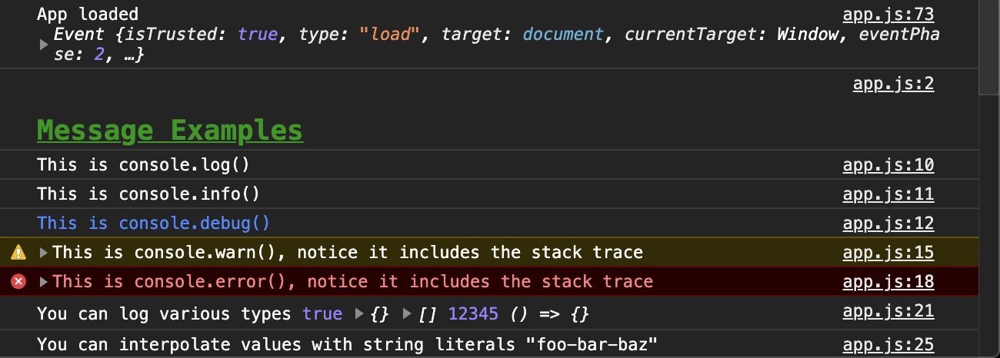
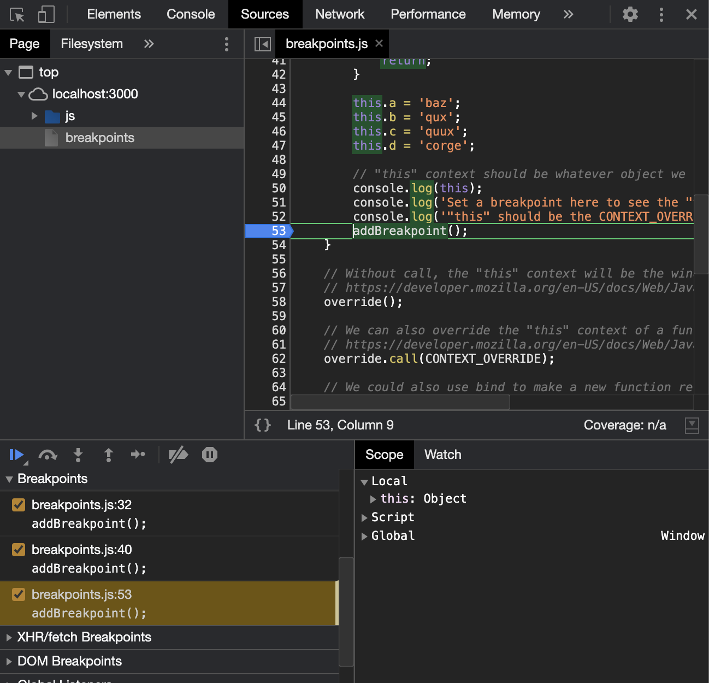
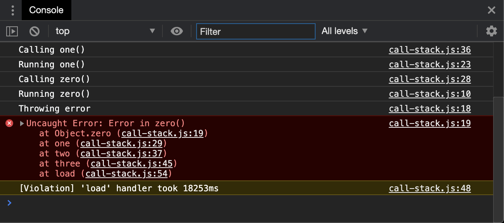
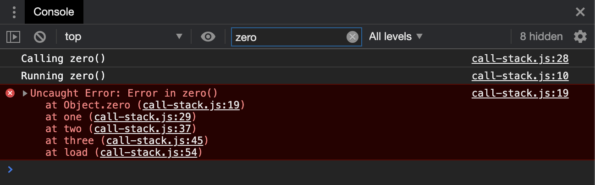

# debugging-usage

Debugging, how does it work? This project is broken down in to separate files, each showcasing a different type of debugging usage.

# Setup

1. Clone repo locally
2. Run `npm ci`

# Usage

Run `npm start` to start the Express server locally.

## Console

1. Go to [localhost:3000](http://www.localhost:3000)
2. Open the developer console
3. View the logs

## Breakpoints

1. Go to [localhost:3000](http://www.localhost:3000)
2. Open the developer console
3. Go to the sources tab
4. Open `js/breakpoints.js`
5. Click the line number on each line that has the `addBreakpoint()` function to add a breakpoint
6. Refresh the page

## Call Stack

1. Go to [localhost:3000/call-stack](http://www.localhost:3000/call-stack)
2. Open the developer console
3. View the logs
4. Go to [localhost:3000/call-stack?debug](http://www.localhost:3000/call-stack?debug) to enable breakpoints
5. View the stack trace as it fires

6. Optionally, try filtering by zero to see only part of the logs

